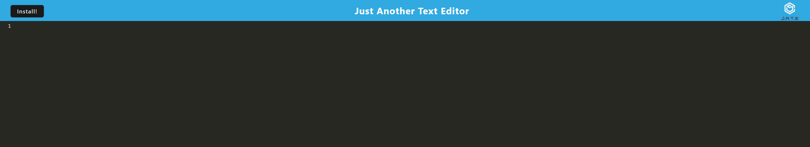

# Just Another Text Editor (J.A.T.E)

## Description

This is a text editor that runs in the browser; it allows a user to input text just like any other text editor. It is a Progressive Web Application (PWA), so it can be installed and works offline.

## Table of Contents

* [Usage](#usage)

* [License](#license)

* [Contributing](#contributing)

* [Credits](#credits)

* [Questions](#questions)

## Usage

Follow [this](https://salty-everglades-84286-25deefdc293b.herokuapp.com/) link to open the application.

On opening the application, you will see the following page:

The user can then enter and edit text in the browser. They can also install the PWA by clicking the install button in the top left corner.

## License

N/A

## Contributing

Feel free to contribute!

## Credits

N/A

## Questions

If you have any questions about the repo, open an issue or contact me directly at jbriseno2000@gmail.com. You can find more of my work at [jb6131](https://github.com/jb6131/).